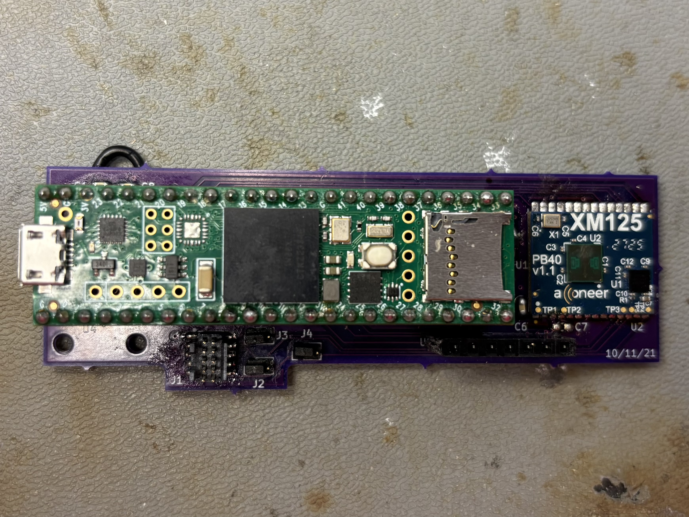
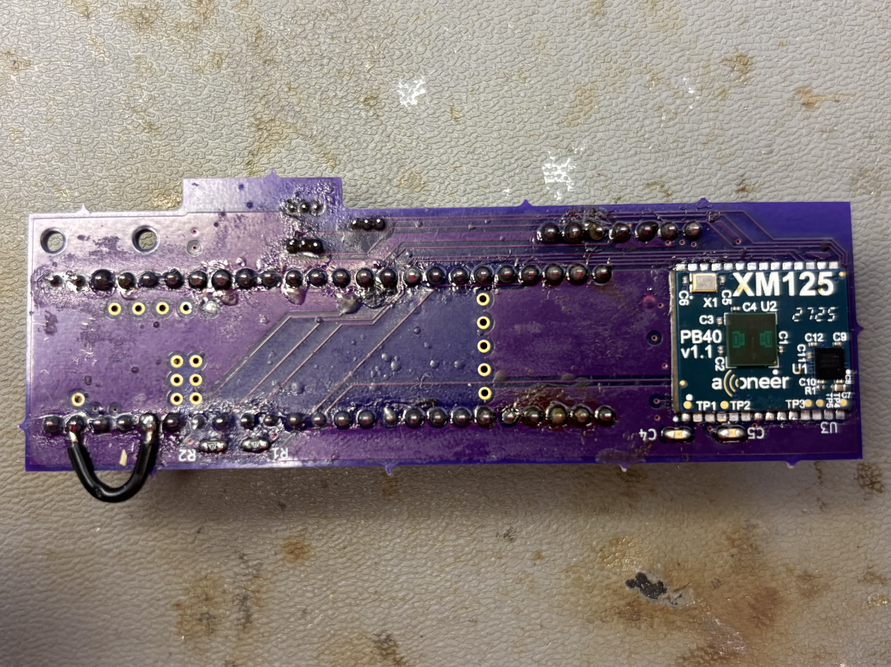
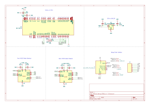

# XM125 Teensy Radar Project

This repository contains the files for a custom PCB project that integrates Acconeer's XM125 radar sensor with a Teensy microcontroller.

## Hardware

Here are some pictures of the physical setup.

### Front

### Back

## PCB Schematic

The schematic for the custom PCB is shown below. This board breaks out the necessary connections for the XM125 radar sensor and provides a platform for development with a Teensy.

